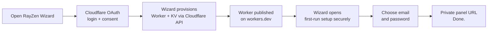

<div align="center">


# RayZen

**A premium networking application that lives entirely on Cloudflare's edge.**
No VPS. No monthly bill. No server of mine anywhere near your credentials.

[**Deploy with RayZen Wizard →**](https://rayzen.bond)

[](LICENSE)


**English** · [فارسی](README_fa.md)

</div>

---

## Why this exists

I got tired of staring at setup guides and thinking, **“what the fu— am I supposed to
click now?”** A networking panel should not require a ritual involving three dashboards,
a terminal tab graveyard, and one API token you are slightly afraid to paste anywhere.

So I built the part I wanted to exist: **go to [rayzen.bond](https://rayzen.bond), sign
in to Cloudflare, approve the permissions, and let the wizard do the boring work.** It
creates a fresh Worker and KV namespace in *your* Cloudflare account, wires the binding,
publishes the Worker, and sends you to first-run setup. You choose an email and password.
Done.

The target level of difficulty is deliberately low. If my dead goldfish could get through
a Cloudflare consent screen, I would expect it to deploy RayZen successfully. The fish is
still unavailable for QA, so there are tests instead.

RayZen is still self-hosted. The wizard is an installer, not a hosted panel: your runtime,
settings, credentials, subscriptions and KV data live in your Cloudflare account, not on
a RayZen server.

## Screenshots

<table>
<tr>
<td width="50%"><b>Sign in</b><br></td>
<td width="50%"><b>Dashboard, light</b><br></td>
</tr>
<tr>
<td><b>Dashboard, dark</b><br></td>
<td><b>Persian, right-to-left</b><br></td>
</tr>
<tr>
<td><b>Mobile</b><br></td>
<td><b>Mobile, Persian</b><br></td>
</tr>
</table>

## Install it

<table>
<tr><td width="25%">

### Deployment wizard

[**Open rayzen.bond →**](https://rayzen.bond)

Sign in to Cloudflare, approve RayZen, and the wizard creates a **new** Worker, KV
namespace, binding and `workers.dev` URL in your account. Each clean visit starts from a
fresh deployment screen instead of resurrecting the last Worker you created.

No GitHub account. No fork. No API token to create. No “step 17: now install Python.”

</td><td width="25%">

### No GitHub

```bash
npm ci
npm run build
npm run install:cloudflare
```

Asks for a Cloudflare API token, picks a random Worker name, creates the KV
namespace, uploads the Worker and prints the URL.

No repository, no fork, no wrangler.

</td><td width="25%">

### From a clone

```bash
git clone https://github.com/matttsys/RayZen-Panel.git
cd RayZen-Panel
npm ci
npx wrangler kv namespace create rayzen \
  --binding kv --update-config
npm run deploy
```

Same Worker, in version control, under a generated name.

</td><td width="25%">

### Pinned identity

```bash
npm run build
RAYZEN_MAIN_DOMAIN=... \
RAYZEN_ACC_EMAIL=... \
npm run package
npx wrangler deploy \
  dist/worker.deploy.js
```

For reproducing an existing deployment exactly. Most people never need this.

</td></tr>
</table>

Full walkthrough, every environment variable, custom domains and rollback:
[`docs/DEPLOYMENT.md`](docs/DEPLOYMENT.md).

### What the wizard actually does



The wizard is only a deployment control plane. It does not host your panel or KV data.
OAuth credentials are short-lived, kept out of browser JavaScript, and revoked after a
successful OAuth deployment. Every new deployment downloads the current
`main/dist/worker.js` from this repository, so pushing a new production build updates what
future installs receive without turning the user's account into a GitHub integration.

## What you get

<table>
<tr>
<td width="50%">

**Configuration panel**
Light and dark, English and Persian with real RTL, no third-party fonts or scripts.
Every asset is compiled into the Worker.

</td>
<td width="50%">

**Subscription generation**
VLESS and Trojan in `normal`, `raw`, `fragment`, `warp` and `warp-pro`, for fifteen
clients across five cores.

</td>
</tr>
<tr>
<td>

**Endpoint scanner**
Cloudflare-aware clean-IP scanning with scoring, confidence, lifecycle tracking and
recommendations you can act on rather than read.

</td>
<td>

**Health Center**
Preflight checks with actual fixes attached, plus runtime health, a bounded audit
history and usage analytics.

</td>
</tr>
<tr>
<td>

**DoH resolver**
A DNS-over-HTTPS endpoint on your own hostname, at `/{path}/dns-query`.

</td>
<td>

**Telegram bot**
Optional. Hands out configs through a chat, so you are not copying links on a phone
keyboard.

</td>
</tr>
<tr>
<td>

**Backup and restore**
Export settings with secrets stripped, preview a restore as a diff before it writes
anything.

</td>
<td>

**Security posture**
Strict CSP with build-time hashes, `HttpOnly` sessions, no secrets in responses, and a
fallback that makes unmatched paths boring.

</td>
</tr>
</table>

## How it works

```
                        ┌──────────────────────────────┐
   VPN client ────────▶ │   Cloudflare Worker (edge)   │
   (v2rayNG, sing-box,  │                              │
    Clash, WireGuard…)  │  VLESS / Trojan / WARP relay │──────▶ Internet
                        │  DoH resolver                │
                        │  Subscription generator      │
                        │  Panel UI (embedded)         │
                        └──────────────┬───────────────┘
                                       │ Cloudflare KV
                                       ▼
                          identity, settings, password,
                          WARP keys, metrics, history
```

One ES-module Worker, written in strict TypeScript, bundled by esbuild. The panel HTML,
CSS, JS, icon font and favicon are all embedded in the artifact, so the thing you deploy
is a single file. It even carries its own gzipped source, which is how the panel can
redeploy itself without fetching anything from the internet.

**Identity resolution** is the part I would read if I were you. A deployment needs a
hostname, a panel path, a UUID, a Trojan password and an email before it can serve
anything, and the Deploy button knows none of them. So RayZen resolves them per
request: from the embedded block if the script carries one, then from Worker
environment variables, then from KV, generating a fresh set on the first request when
there is nothing. The hostname always comes from the request itself, so a Worker
answering on both `workers.dev` and a custom domain generates the right configs for
whichever one the client used.

Details, including why the KV binding has to be called exactly `kv` and why there are
hundreds of unreachable variable declarations in every uploaded script:
[`docs/ARCHITECTURE.md`](docs/ARCHITECTURE.md).

## Security

The short version: **the security boundary is your Cloudflare login.** Everything
RayZen knows is in your account, readable by anyone who can read your account, and by
nobody else.

- Sessions are HS256 JWTs in `HttpOnly`, `Secure`, `SameSite=Strict` cookies, signed
  with a key generated per deployment.
- Every page ships `default-src 'none'` with build-time script and style hashes. No
  inline handlers, no third-party assets, and `connect-src` restricted per page.
- The Cloudflare account id and API token are read from the environment and **never**
  written to KV, so they cannot leak through an export or a backup.
- Unmatched paths get no RayZen headers and no RayZen branding, so a scanner walking
  paths learns nothing about what it found.
- Failed logins are counted, never described. No username, no IP, no timestamp finer
  than the day.

And the limitations, because a security section that only lists strengths is marketing:
there is no application-level login rate limit beyond Cloudflare's own, the scanner
measures from one edge location, WARP registration depends on an external service, and
there is no signed release feed. Passwords are salted PBKDF2 verifiers (100,000
iterations for Cloudflare Workers compatibility), and older plaintext KV values
migrate after the next successful login. Full detail,
plus the two variables that close the first-run claim window, in
[`SECURITY.md`](SECURITY.md).

## Supported clients

| Variant | Core | Clients |
| --- | --- | --- |
| Normal | xray | v2rayN(G), MahsaNG, Streisand |
| Normal | sing-box | sing-box, husi |
| Normal | clash | Clash Meta, Clash Verge, FlClash, Stash |
| Fragment | xray | v2rayN(G), MahsaNG, Streisand |
| Fragment | sing-box | sing-box, husi |
| Raw | xray | v2rayN(G), MahsaNG, Shadowrocket, Streisand, PassWall |
| Raw | sing-box | husi, NekoBox, Hiddify, Karing |
| Warp | xray | v2rayN(G), Streisand |
| Warp | sing-box | sing-box, husi |
| Warp | clash | Clash Meta, Clash Verge, FlClash, Stash |
| Warp | wireguard | WireGuard |
| Warp Pro | xray | v2rayN(G), Streisand |
| Warp Pro | xray-knocker | MahsaNG, v2rayN-PRO |
| Warp Pro | clash | Clash Meta, Clash Verge, FlClash, Stash |
| Warp Pro | amnezia | Amnezia, WG Tunnel |

Subscription URLs look like this, and the panel shows the ready-to-copy version for
every client:

```
https://<your-panel>/<securePath>/sub/<variant>?app=<core>
```

`<core>` is one of `xray`, `sing-box`, `clash`, `wireguard`, `amnezia` or
`xray-knocker`.

### Sharing with other people

The link above is yours, and it cannot be revoked without changing `securePath` and
re-importing on every device you own. So don't share it. Create a **shared link** instead,
from the card below the subscription table:

```
https://<your-panel>/<securePath>/p/<token>/sub/<variant>?app=<core>
```

Each shared link has a name, an optional expiry, and its own on/off switch, so switching
one off leaves yours and everyone else's working. The panel shows when each was last
fetched and from which country, which is enough to notice a link that has been passed
onward. Up to 20 per deployment.

Revoking keeps the row so you can still see the link existed and when it was last used;
deleting removes both. A revoked, expired or unknown token gets the same response as any
other unmatched URL, so nobody can tell a revoked link from one that never existed.

There is no byte quota, deliberately. Cloudflare KV loses concurrent increments by design,
so a quota built on it would let traffic through while reporting that it had not, and a
number that is wrong in your favour is worse than no number. The fetch count is a lower
bound on requests, not traffic accounting.

## Configuration

Everything is in the panel's **Settings** tab. The parts people actually change:

**Identity** — VLESS UUID, Trojan password, panel path, sign-in email.

**Protocols** — which of VLESS and Trojan are enabled, ports, fragment and UDP-noise
obfuscation, TLS fingerprint, ECH.

**Routing** — DNS servers including an anti-sanction resolver, IP version, WARP, bypass
rules (Iran, China, Russia, and sanctioned services like OpenAI, Google AI, Microsoft,
Oracle, Docker, Adobe, Epic Games and several hardware vendors), block rules (ads, porn,
malware, phishing, cryptominers, UDP 443), plus your own bypass and block lists.

**Client compatibility** — `Universal` (the default) or `Latest cores only`. Universal
generates configurations that every mainstream core accepts, which is what makes a
subscription work in the v2rayNG or Streisand build you already have. Pick `Latest` only
if every device you use runs a current Xray core and you want its newest obfuscation.
Use `Universal` unless you have a reason not to; future-you will appreciate the restraint.

**Clean IPs and CDN** — scanner results and custom CDN addresses.

**Telegram bot** — token and authorised user id.

**Import / Export** — move settings between deployments; secrets are stripped on
export.

**Custom domain** — attach your own. Worth doing: `workers.dev` is blocked on some
networks.

A few things you can pin at deploy time instead, if you want them fixed rather than
generated:

```bash
RAYZEN_ADMIN_EMAIL=you@example.com    # also closes the first-run claim window
RAYZEN_SECURE_PATH=myOwnSecretPath
RAYZEN_CF_ACCOUNT_ID=...              # unlocks usage stats + in-panel custom domains
RAYZEN_CF_API_TOKEN=...
```

The full list is in [`docs/DEPLOYMENT.md`](docs/DEPLOYMENT.md).

## Roadmap

The rule is simple: add things that make RayZen more reliable, easier to operate, or less
annoying. Do not add a distributed microservice architecture because somebody discovered
a new diagram tool.

**Next**

- Application-level login rate limiting, independent of Cloudflare's protections.
- A signed release channel for safe in-panel updates.
- Better multi-vantage scanner measurements so one edge location is not treated as the
  opinion of the entire internet.

**Later**

- Scheduled scans through Cloudflare-native scheduling.
- More client presets based on real compatibility reports.
- A clean update path for already-deployed Workers; the wizard installs the exact release bundled with the current Wizard deployment.

**Not planned**

- A centralized hosted panel. That would defeat the point spectacularly.
- Multi-tenant user data on RayZen infrastructure. Your deployment is yours.

## Development

```bash
npm ci
npm run check     # tsc, strict
npm test          # test suite
npm run build     # dist/worker.js
npm run size      # bundle budget, enforced
npm run preview   # runs the built Worker locally on an in-memory KV
```

The build is byte-reproducible and CI asserts it. Subscription output is pinned by
golden fixtures: 14 targets across 12 profiles, so changing a generated byte means
changing a committed file, which is exactly the review you want on a config generator.

`npm run preview` is the one I use most. It serves the real built artifact against a
fake KV, so you can click through the panel without deploying anything.

## Contributing

Yes please, especially bug reports with a subscription variant and client name
attached. [`CONTRIBUTING.md`](CONTRIBUTING.md) has the setup, the code style and what I
look for in a pull request.

If you are about to open a PR that touches `src/cores/`, run the tests first. The golden
fixtures will tell you what you changed before I have to.

## Credits and license

[GPL-3.0](LICENSE).

RayZen started as a fork of **[BPB Worker Panel](https://github.com/bia-pain-bache/BPB-Worker-Panel)**
by **bia-pain-bache**. BPB built a genuinely useful Cloudflare Worker panel and deserves
clear credit for the foundation RayZen came from. RayZen has since diverged heavily in
its panel UI, deployment wizard, scanner, diagnostics, product structure, onboarding and
security work, but pretending the family tree does not exist would be weird.

Respect the upstream work. Forks are normal. Amnesia is optional.

Not affiliated with or endorsed by Cloudflare.

---

<div align="center">

Built by **Matin** · [Telegram](https://t.me/matttsys) · [GitHub](https://github.com/matttsys)

<sub>If RayZen saved you a VPS bill, that is the whole idea. Or a headache.</sub>

</div>
