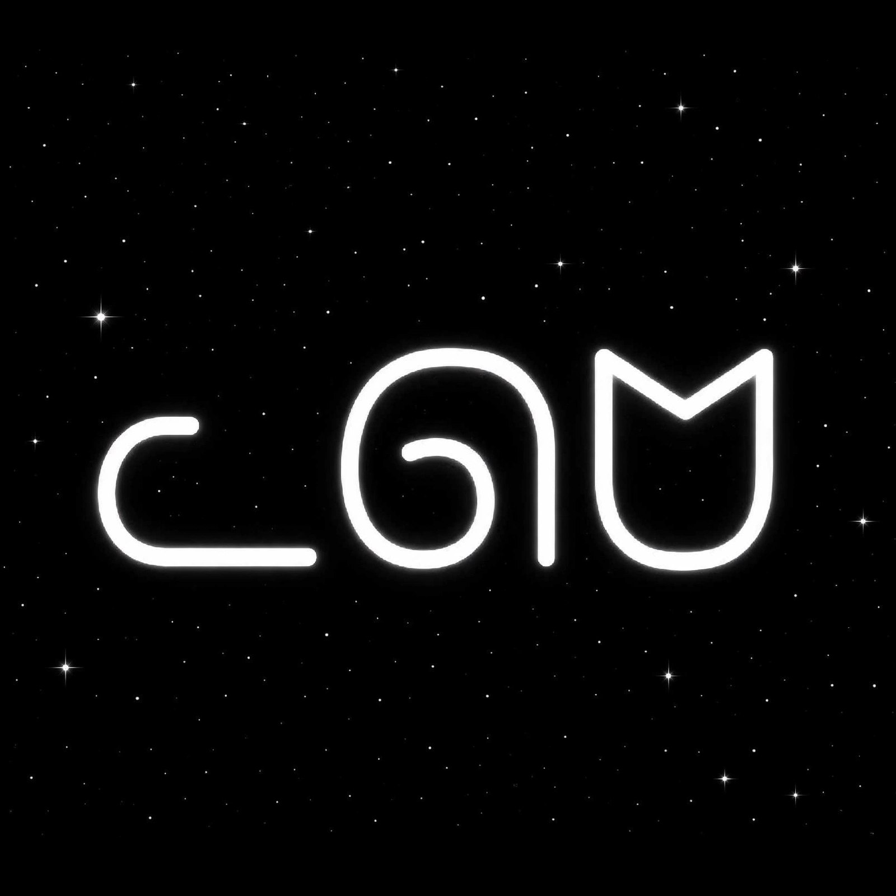
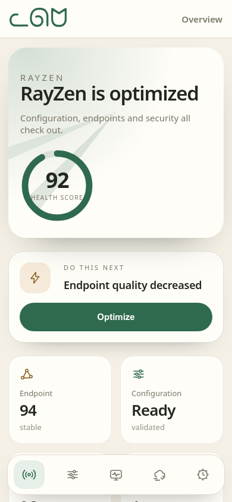

<div align="center">



# RayZen Panel

Self-hosted networking control plane for Cloudflare Workers.

[Deploy with RayZen Wizard](https://rayzen.bond) · [فارسی](README_fa.md)

[](LICENSE)


</div>

RayZen Panel packages the Worker runtime, browser control panel, first-run setup and deployment Wizard in one repository. Settings, credentials, sessions, subscriptions and operational history remain in the operator's Cloudflare account.

RayZen Companion uses the Panel as its official backend. It authenticates directly with the operator-owned Worker, reads health and diagnostics, and applies selected scanner results through a narrow validated endpoint. The Companion contains its own native scanner; there is no separate scanner service to deploy.

## Screenshots

<table>
<tr>
<td width="50%"><b>Dashboard, light</b><br></td>
<td width="50%"><b>Dashboard, dark</b><br></td>
</tr>
<tr>
<td><b>Persian and RTL</b><br></td>
<td><b>Mobile</b><br></td>
</tr>
</table>

## Capabilities

- VLESS, Trojan, WARP and WARP Pro subscription generation for Xray, sing-box, Clash, WireGuard and Amnezia clients.
- Seven complete light/dark themes: Midnight, Ocean, Aurora, Forest, Tropical, Lavender and Sunset.
- English and Persian interfaces with right-to-left layout support.
- Health Center, deployment preflight, diagnostics, metrics and bounded audit history.
- Configured-endpoint scanning, scheduling, scoring, confidence and lifecycle intelligence.
- Per-recipient subscription links with revocation, expiry and coarse usage history.
- Settings backup, validation, comparison and restore planning with secrets redacted.
- Optional Telegram integration, DNS-over-HTTPS endpoint and custom-domain management.
- Strict per-page CSP, hardened session cookies and no external UI assets.

## Deployment

### RayZen Wizard

Open [rayzen.bond](https://rayzen.bond), authorize Cloudflare, select an account and complete first-run setup. The Wizard creates a Worker and KV namespace in the selected account and deploys the exact SHA-256-pinned artifact bundled with its release.

The Wizard is a deployment control plane only. It does not host the Panel, credentials or KV data.

### From source

Requirements: Node.js 20.10 or newer and a Cloudflare account.

```bash
git clone https://github.com/matttsys/RayZen-Panel.git
cd RayZen-Panel
npm ci
npx wrangler kv namespace create rayzen \
  --binding kv --update-config
npm run deploy
```

The deployment generates a safe Worker name. On first request, the Worker creates its identity in KV and serves a one-time setup flow.

### Direct installer

```bash
npm ci
npm run build
npm run install:cloudflare
```

The installer validates a Cloudflare API token, provisions KV, uploads the Worker and prints the setup URL. It does not store the token.

### Pinned identity

Use this only when reproducing a known deployment identity:

```bash
npm run build
RAYZEN_MAIN_DOMAIN=rayzen.example.workers.dev \
RAYZEN_ACC_EMAIL=owner@example.com \
npm run package
npx wrangler deploy dist/worker.deploy.js
```

The packaged artifact contains connection credentials and the administrator email. Do not commit or publish it.

See [Deployment](docs/DEPLOYMENT.md) for environment variables, custom domains, rollback and recovery.

## Companion API

All paths are relative to `https://<worker>/<securePath>/`.

| Purpose | Method and path | Authentication |
| --- | --- | --- |
| Product discovery | `GET panel/version` | Public |
| Sign in | `POST login/authenticate` | Email and password |
| Settings and profile data | `GET panel/settings` | Session cookie |
| Cloudflare usage | `GET panel/usage` | Session cookie |
| Health | `GET panel/platform/health` | Session cookie |
| Diagnostics | `GET panel/platform/advanced/diagnostics` | Session cookie |
| Scanner history | `GET panel/platform/scanner/history` | Session cookie |
| Apply a clean IP | `POST panel/platform/scanner/apply` | Session cookie |

`panel/version` identifies the product as `RayZen Panel`, declares Companion API version `1`, and lists supported capabilities. `scanner/apply` accepts one validated address and changes only `cleanIPs`; it cannot overwrite unrelated settings.

The complete contract is in [Integration contracts](docs/INTEGRATION-CONTRACTS.md).

## Supported clients

| Variant | Core | Clients |
| --- | --- | --- |
| Normal | Xray | v2rayN(G), MahsaNG, Streisand |
| Normal | sing-box | sing-box, husi |
| Normal | Clash | Clash Meta, Clash Verge, FlClash, Stash |
| Fragment | Xray | v2rayN(G), MahsaNG, Streisand |
| Fragment | sing-box | sing-box, husi |
| Raw | Xray | v2rayN(G), MahsaNG, Shadowrocket, Streisand, PassWall |
| Raw | sing-box | husi, NekoBox, Hiddify, Karing |
| WARP | Xray | v2rayN(G), Streisand |
| WARP | sing-box | sing-box, husi |
| WARP | Clash | Clash Meta, Clash Verge, FlClash, Stash |
| WARP | WireGuard | WireGuard |
| WARP Pro | Xray | v2rayN(G), Streisand |
| WARP Pro | Xray Knocker | MahsaNG, v2rayN-PRO |
| WARP Pro | Clash | Clash Meta, Clash Verge, FlClash, Stash |
| WARP Pro | Amnezia | Amnezia, WG Tunnel |

## Security model

- Administrator sessions use signed JWTs in `HttpOnly`, `Secure`, `SameSite=Strict` cookies.
- Passwords are stored as salted PBKDF2-SHA-256 verifiers at the Cloudflare Workers compatibility ceiling.
- Cloudflare account credentials are read from environment bindings and never written to KV or backups.
- Browser pages use build-time CSP hashes and load no third-party scripts, styles, fonts or icons.
- Backups redact the panel path, protocol credentials and other protected values.
- Unmatched paths carry no RayZen branding or distinctive application headers.

Important limitations and recovery procedures are documented in [Security](SECURITY.md).

## Development and release verification

```bash
npm ci
npm run verify:release
npm run verify:tdz-build-matrix
npm run test:deploy-flow
XDG_CONFIG_HOME=/tmp/rayzen-wrangler npm run deploy:check
```

`verify:release` runs strict TypeScript checking, documentation-link checks, the complete Vitest suite, a production build, Wizard artifact synchronization, Wizard tests and the bundle-size gate.

Release artifacts:

- `dist/worker.js` — credential-free Worker deployed by the Wizard and normal Wrangler flow.
- `wizard/artifacts/worker.js` — byte-identical Wizard copy.
- `dist/build-manifest.json` and `wizard/artifacts/manifest.json` — version, toolchain, build marker, size and SHA-256 metadata.

## Documentation

- [Architecture](docs/ARCHITECTURE.md)
- [Deployment](docs/DEPLOYMENT.md)
- [Integration contracts](docs/INTEGRATION-CONTRACTS.md)
- [Security](SECURITY.md)
- [Contributing](CONTRIBUTING.md)

## Credits and license

RayZen Panel is licensed under [GPL-3.0](LICENSE).

RayZen began as a fork of [BPB Worker Panel](https://github.com/bia-pain-bache/BPB-Worker-Panel) by bia-pain-bache. RayZen retains clear attribution for that foundation while maintaining its own interface, deployment system, diagnostics, scanner integration and release process.

RayZen is not affiliated with or endorsed by Cloudflare.
