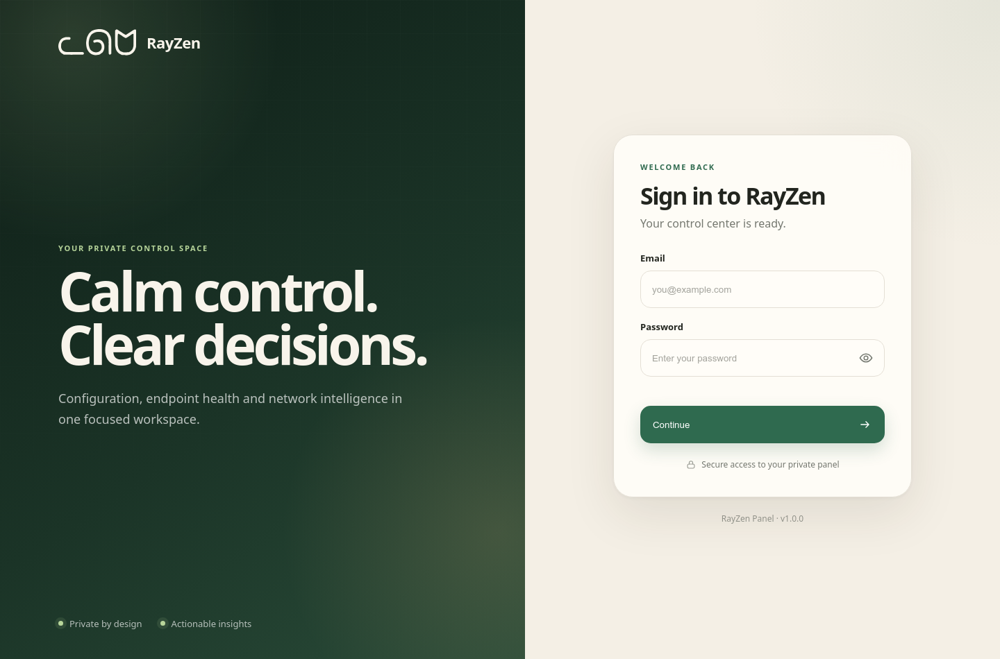
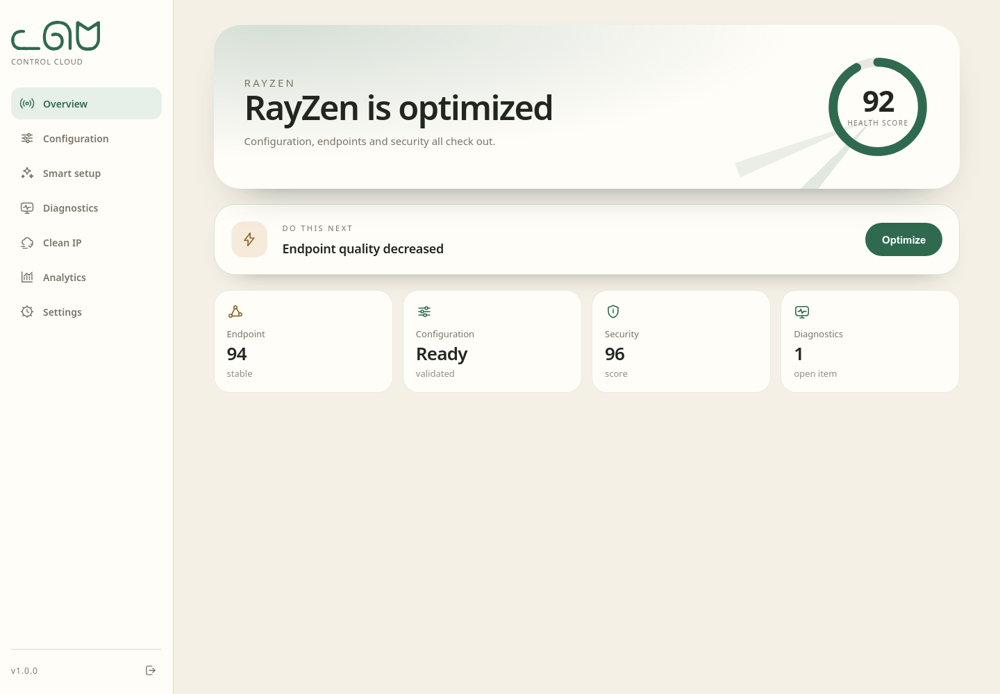
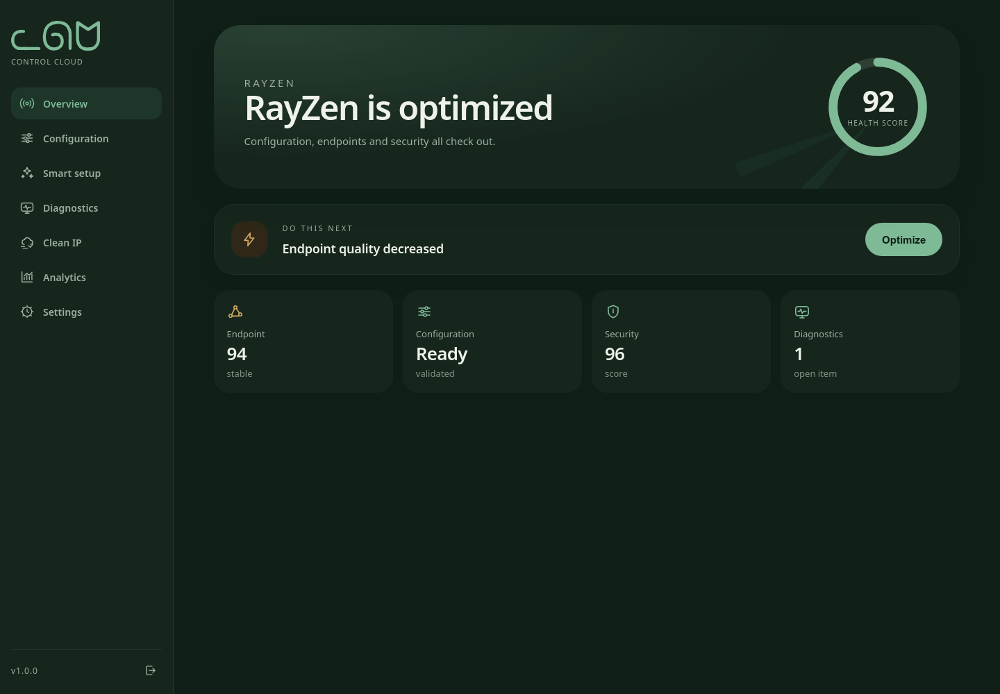
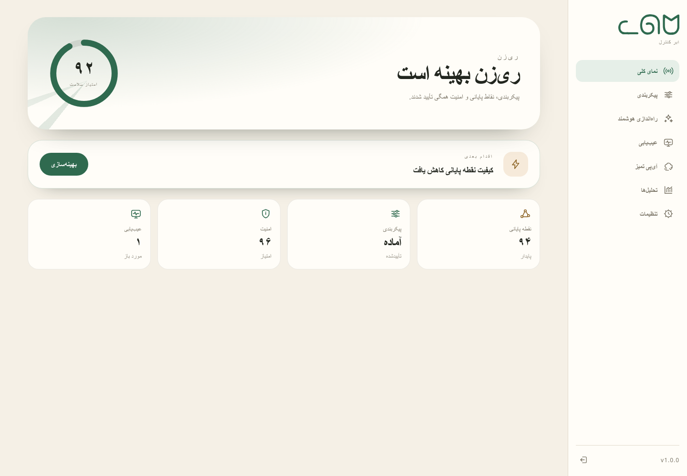
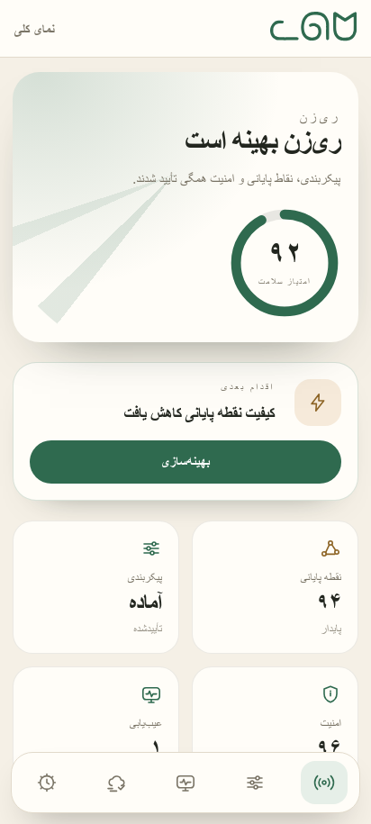
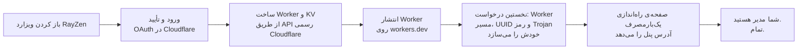

<div align="center">


# پنل RayZen

**پنلی که تمام‌وکمال روی لبه‌ی Cloudflare زندگی می‌کند.**
بدون VPS. بدون هزینه‌ی ماهانه. و هیچ سروری از من نزدیک اطلاعات شما نیست.

[**استقرار با ویزارد RayZen ←**](https://rayzen.bond)

[](LICENSE)


[English](README.md) · **فارسی**

</div>

---

## چرا این پروژه ساخته شد

از یک چرخه‌ی تکراری خسته شدم: اجاره‌ی VPS، سخت‌سازی‌اش، و بعد تماشای بلاک‌شدن آی‌پی‌اش
در فاصله‌ی یک هفته. بعد از پنل‌هایی خسته شدم که قرار بود همین را حل کنند، اما یا
می‌خواستند توکن API را در وب‌سایت شخص دیگری وارد کنید یا قبل از دیدن صفحه‌ی ورود، بیست
دقیقه کار با ترمینال لازم داشتند.

پس RayZen شد یک Worker، یک فضای KV و یک دکمه. دکمه را می‌زنید، Cloudflare کد را در
حساب *خودتان* مستقر می‌کند و Worker در نخستین درخواست، اطلاعات هویتی خودش را تولید
می‌کند. هیچ چیزی از استقرار شما جایی که من دسترسی داشته باشم وجود ندارد.

بخش‌هایی که خودم هر روز استفاده می‌کنم، یعنی اسکنر اندپوینت و بررسی‌های سلامت، همان
بخش‌هایی هستند که اول ساختم. احتمالاً این در کد پیداست.

## تصاویر

<table>
<tr>
<td width="50%"><b>ورود</b><br></td>
<td width="50%"><b>داشبورد، روشن</b><br></td>
</tr>
<tr>
<td><b>داشبورد، تیره</b><br></td>
<td><b>فارسی، راست‌به‌چپ</b><br></td>
</tr>
<tr>
<td><b>موبایل</b><br></td>
<td><b>موبایل، فارسی</b><br></td>
</tr>
</table>

## نصب

### ویزارد استقرار — پیشنهادشده

[**باز کردن rayzen.bond ←**](https://rayzen.bond)

وارد Cloudflare شوید و RayZen را تأیید کنید. ویزارد Worker، فضای KV، binding و آدرس
workers.dev را مستقیماً در حساب خودتان می‌سازد.

بدون GitHub، بدون مخزن و بدون ساخت دستی API Token.

### بدون GitHub

```bash
npm ci
npm run build
npm run install:cloudflare
```

نصب‌کننده یک توکن API از Cloudflare می‌خواهد، یک نام تصادفی برای Worker انتخاب می‌کند،
فضای KV را می‌سازد، Worker را بارگذاری می‌کند و آدرس نهایی را چاپ می‌کند. بدون مخزن،
بدون فورک، بدون wrangler.

توکن با سه دسترسی ساخته می‌شود: Workers Scripts (Edit)، Workers KV Storage (Edit) و
Account Settings (Read). توکن هیچ‌جا ذخیره نمی‌شود و داخل Worker قرار نمی‌گیرد.

### از یک کلون

```bash
git clone https://github.com/matttsys/RayZen-Panel.git
cd RayZen-Panel
npm ci
npx wrangler kv namespace create rayzen --binding kv --update-config
npx wrangler deploy --name $(npm run -s name)
```

همان Worker، این بار زیر کنترل نسخه و با یک نام تولیدشده.

### با هویت ثابت

```bash
npm run build
RAYZEN_MAIN_DOMAIN=my-panel.example.workers.dev \
RAYZEN_ACC_EMAIL=you@example.com \
npm run package
npx wrangler deploy dist/worker.deploy.js
```

برای بازتولید دقیق یک استقرار موجود. بیشتر کاربران هرگز به این روش نیاز پیدا نمی‌کنند.

راهنمای کامل، همه‌ی متغیرهای محیطی، دامنه‌ی اختصاصی و بازگشت به نسخه‌ی قبل:
[`docs/DEPLOYMENT.md`](docs/DEPLOYMENT.md).

### ویزارد دقیقاً چه کاری می‌کند



ویزارد فقط کنترل‌پلین استقرار است؛ پنل یا داده‌های KV شما را میزبانی نمی‌کند. در مسیر
OAuth، اعتبارنامه کوتاه‌عمر است، وارد JavaScript مرورگر نمی‌شود و پس از استقرار موفق
revoke می‌شود. اطلاعات هویتی خود Worker داخل همان Worker ساخته و در حساب Cloudflare
خودتان نگهداری می‌شود.

## چه چیزی می‌گیرید

<table>
<tr>
<td width="50%">

**پنل پیکربندی**
روشن و تیره، انگلیسی و فارسی با راست‌به‌چپ واقعی، بدون فونت یا اسکریپت شخص ثالث. همه‌ی
دارایی‌ها داخل خود Worker کامپایل شده‌اند.

</td>
<td width="50%">

**تولید سابسکریپشن**
VLESS و Trojan در حالت‌های `normal`، `raw`، `fragment`، `warp` و `warp-pro` برای پانزده
کلاینت روی پنج هسته.

</td>
</tr>
<tr>
<td>

**اسکنر اندپوینت**
اسکن آی‌پی تمیز با آگاهی از Cloudflare، همراه با امتیازدهی، سطح اطمینان، ردیابی
چرخه‌ی عمر و توصیه‌هایی که قابل اجرا هستند، نه فقط قابل خواندن.

</td>
<td>

**مرکز سلامت**
بررسی‌های پیش از استقرار با راه‌حل پیوست‌شده، به‌همراه سلامت زمان اجرا، تاریخچه‌ی
محدودشده و تحلیل مصرف.

</td>
</tr>
<tr>
<td>

**رزولور DoH**
یک اندپوینت DNS-over-HTTPS روی دامنه‌ی خودتان، در مسیر `/{path}/dns-query`.

</td>
<td>

**ربات تلگرام**
اختیاری. کانفیگ‌ها را داخل چت تحویل می‌دهد تا مجبور نباشید لینک‌ها را با کیبورد گوشی
کپی کنید.

</td>
</tr>
<tr>
<td>

**پشتیبان‌گیری و بازیابی**
خروجی تنظیمات بدون اسرار، و پیش‌نمایش بازیابی به شکل تفاوت‌ها پیش از هر نوشتنی.

</td>
<td>

**وضعیت امنیتی**
CSP سخت‌گیرانه با هش‌های زمان ساخت، نشست `HttpOnly`، بدون اسرار در پاسخ‌ها، و
fallback‌ای که مسیرهای نامرتبط را بی‌اهمیت جلوه می‌دهد.

</td>
</tr>
</table>

## چطور کار می‌کند

```
                        ┌──────────────────────────────┐
   کلاینت VPN ────────▶ │   Cloudflare Worker (edge)   │
   (v2rayNG، sing-box،  │                              │
    Clash، WireGuard…)  │  VLESS / Trojan / WARP relay │──────▶ اینترنت
                        │  DoH resolver                │
                        │  Subscription generator      │
                        │  Panel UI (embedded)         │
                        └──────────────┬───────────────┘
                                       │ Cloudflare KV
                                       ▼
                          هویت، تنظیمات، رمز عبور،
                          کلیدهای WARP، متریک، تاریخچه
```

یک Worker از نوع ES module، نوشته‌شده با TypeScript در حالت strict و بسته‌بندی‌شده با
esbuild. HTML و CSS و JS پنل، فونت آیکون و favicon همه داخل خروجی جاسازی شده‌اند، پس
چیزی که مستقر می‌کنید یک فایل واحد است. حتی سورس فشرده‌ی خودش را هم حمل می‌کند و همین
است که به پنل اجازه می‌دهد بدون دریافت چیزی از اینترنت خودش را دوباره مستقر کند.

**تشخیص هویت استقرار** بخشی است که اگر جای شما بودم می‌خواندم. هر استقرار پیش از سرو
کردن چیزی به یک نام میزبان، مسیر پنل، UUID، رمز Trojan و ایمیل نیاز دارد، و دکمه‌ی
Deploy هیچ‌کدام را نمی‌داند. پس RayZen آن‌ها را در هر درخواست تشخیص می‌دهد: اگر اسکریپت
بلوک جاسازی‌شده دارد از آن، سپس از متغیرهای محیطی Worker، سپس از KV، و اگر هیچ‌کدام
نبود در نخستین درخواست یک مجموعه‌ی تازه می‌سازد. نام میزبان همیشه از خود درخواست خوانده
می‌شود، پس Worker‌ای که هم روی `workers.dev` و هم روی دامنه‌ی اختصاصی پاسخ می‌دهد،
کانفیگ درست را برای همان دامنه‌ای می‌سازد که کلاینت استفاده کرده است.

جزئیات، از جمله این‌که چرا نام اتصال KV باید دقیقاً `kv` باشد و چرا در هر اسکریپت
آپلودشده صدها تعریف متغیر بی‌استفاده وجود دارد:
[`docs/ARCHITECTURE.md`](docs/ARCHITECTURE.md).

## امنیت

خلاصه‌اش: **مرز امنیتی، حساب Cloudflare شماست.** هر چیزی که RayZen می‌داند داخل حساب
شماست، برای هر کسی که به حساب شما دسترسی خواندن دارد قابل خواندن است، و برای هیچ‌کس
دیگر.

- نشست‌ها JWT با HS256 هستند، داخل کوکی `HttpOnly` و `Secure` و `SameSite=Strict`، با
  کلیدی که برای هر استقرار جداگانه ساخته می‌شود.
- هر صفحه با `default-src 'none'` و هش‌های زمان ساخت برای اسکریپت و استایل ارسال
  می‌شود. بدون هندلر inline، بدون دارایی شخص ثالث، و `connect-src` محدود برای هر صفحه.
- شناسه‌ی حساب و توکن API فقط از محیط خوانده می‌شوند و **هرگز** در KV نوشته نمی‌شوند،
  پس نمی‌توانند از طریق خروجی تنظیمات یا فایل پشتیبان درز کنند.
- مسیرهای نامرتبط نه هدرهای RayZen می‌گیرند و نه برندینگ آن، پس اسکنری که مسیرها را
  می‌پیماید چیزی درباره‌ی آنچه پیدا کرده یاد نمی‌گیرد.
- ورودهای ناموفق شمرده می‌شوند، نه توصیف. بدون نام کاربری، بدون آی‌پی، و بدون زمانی
  دقیق‌تر از روز.

و محدودیت‌ها، چون بخش امنیتی‌ای که فقط نقاط قوت را فهرست کند تبلیغ است: **رمز عبور پنل
بدون هش در KV ذخیره می‌شود** (اولویت اول نسخه‌ی بعدی)، محدودیت نرخ برای تلاش ورود
جدا از حفاظت‌های خود Cloudflare وجود ندارد، اسکنر از یک نقطه‌ی لبه اندازه‌گیری
می‌کند، و اگر ثبت حساب WARP شکست بخورد از حساب‌های اشتراکی استفاده می‌شود. جزئیات
کامل، به‌همراه دو متغیری که پنجره‌ی تصاحب اولیه را می‌بندند، در
[`SECURITY.md`](SECURITY.md).

## کلاینت‌های پشتیبانی‌شده

| حالت | هسته | کلاینت‌ها |
| --- | --- | --- |
| Normal | xray | v2rayN(G)، MahsaNG، Streisand |
| Normal | sing-box | sing-box، husi |
| Normal | clash | Clash Meta، Clash Verge، FlClash، Stash |
| Fragment | xray | v2rayN(G)، MahsaNG، Streisand |
| Fragment | sing-box | sing-box، husi |
| Raw | xray | v2rayN(G)، MahsaNG، Shadowrocket، Streisand، PassWall |
| Raw | sing-box | husi، NekoBox، Hiddify، Karing |
| Warp | xray | v2rayN(G)، Streisand |
| Warp | sing-box | sing-box، husi |
| Warp | clash | Clash Meta، Clash Verge، FlClash، Stash |
| Warp | wireguard | WireGuard |
| Warp Pro | xray | v2rayN(G)، Streisand |
| Warp Pro | xray-knocker | MahsaNG، v2rayN-PRO |
| Warp Pro | clash | Clash Meta، Clash Verge، FlClash، Stash |
| Warp Pro | amnezia | Amnezia، WG Tunnel |

آدرس سابسکریپشن این شکل را دارد و پنل نسخه‌ی آماده‌ی کپی را برای هر کلاینت نشان
می‌دهد:

```
https://<your-panel>/<securePath>/sub/<variant>?app=<core>
```

مقدار `<core>` یکی از `xray`، `sing-box`، `clash`، `wireguard`، `amnezia` یا
`xray-knocker` است.

### اشتراک‌گذاری با دیگران

لینک بالا مخصوص خودتان است و بدون تغییر `securePath` و وارد کردن دوباره‌ی کانفیگ در همه‌ی
دستگاه‌هایتان قابل لغو نیست. پس آن را به اشتراک نگذارید؛ به‌جایش از کارت پایین جدول
سابسکریپشن یک **لینک اشتراکی** بسازید:

```
https://<your-panel>/<securePath>/p/<token>/sub/<variant>?app=<core>
```

هر لینک اشتراکی یک نام، انقضای اختیاری و کلید خاموش/روشن مستقل دارد، بنابراین خاموش کردن
یکی از آن‌ها روی لینک خودتان و لینک بقیه اثری ندارد. پنل نشان می‌دهد هر لینک آخرین بار چه
زمانی و از کدام کشور دریافت شده است، که برای متوجه شدن لینکی که دست‌به‌دست شده کافی است.
حداکثر ۲۰ لینک برای هر استقرار.

لغو کردن، ردیف لینک را نگه می‌دارد تا ببینید وجود داشته و آخرین استفاده‌اش کِی بوده؛ حذف
کردن هر دو را پاک می‌کند. توکن لغو‌شده، منقضی یا ناشناس همان پاسخی را می‌گیرد که هر نشانی
نامشخص دیگری می‌گیرد، بنابراین کسی نمی‌تواند لینک لغو‌شده را از لینکی که هرگز وجود نداشته
تشخیص دهد.

سهمیه‌ی حجم مصرف عمداً وجود ندارد. KV در Cloudflare طبق طراحی‌اش شمارش‌های همزمان را از
دست می‌دهد، پس سهمیه‌ای که روی آن ساخته شود ترافیک را رد می‌کند و در همان حال گزارش می‌دهد
که رد نکرده؛ عددی که به سود شما اشتباه باشد بدتر از نبودن عدد است. شمارنده‌ی دریافت،
کف تعداد درخواست‌ها است، نه حساب‌رسی ترافیک.

## پیکربندی

همه چیز در تب **Settings** پنل است. بخش‌هایی که واقعاً تغییر داده می‌شوند:

**هویت** — UUID مربوط به VLESS، رمز Trojan، مسیر پنل، ایمیل ورود.

**پروتکل‌ها** — فعال‌بودن VLESS و Trojan، پورت‌ها، مبهم‌سازی fragment و نویز UDP،
اثر انگشت TLS، و ECH.

**مسیریابی** — سرورهای DNS از جمله رزولور ضدتحریم، نسخه‌ی IP، WARP، قواعد عبور (ایران،
چین، روسیه و سرویس‌های تحریمی مثل OpenAI، Google AI، Microsoft، Oracle، Docker، Adobe،
Epic Games و چند سازنده‌ی سخت‌افزار)، قواعد مسدودسازی (تبلیغات، محتوای بزرگسال،
بدافزار، فیشینگ، ماینر، UDP 443)، و فهرست‌های اختصاصی خودتان.

**آی‌پی‌های تمیز و CDN** — نتایج اسکنر و آدرس‌های CDN اختصاصی.

**ربات تلگرام** — توکن و شناسه‌ی کاربر مجاز.

**ورودی / خروجی** — انتقال تنظیمات بین استقرارها؛ اسرار در خروجی حذف می‌شوند.

**دامنه‌ی اختصاصی** — دامنه‌ی خودتان را وصل کنید. ارزشش را دارد: `workers.dev` در
بعضی شبکه‌ها مسدود است.

چند مورد را می‌توانید در زمان استقرار ثابت کنید، اگر ترجیح می‌دهید تولید نشوند:

```bash
RAYZEN_ADMIN_EMAIL=you@example.com    # پنجره‌ی تصاحب اولیه را هم می‌بندد
RAYZEN_SECURE_PATH=myOwnSecretPath
RAYZEN_CF_ACCOUNT_ID=...              # آمار مصرف و دامنه‌ی اختصاصی از داخل پنل
RAYZEN_CF_API_TOKEN=...
```

فهرست کامل در [`docs/DEPLOYMENT.md`](docs/DEPLOYMENT.md).

## نقشه‌ی راه

صادقانه درباره‌ی آنچه در پیش است و آنچه اتفاق نمی‌افتد.

**بعدی**

- هش‌کردن رمز عبور پنل. تنها محدودیتی که واقعاً آزارم می‌دهد.
- محدودیت نرخ برای تلاش‌های ورود، جدا از حفاظت‌های Cloudflare.
- یک فید انتشار امضاشده، تا دکمه‌ی Update پنل بتواند آنچه نصب می‌کند را تأیید کند و از
  حالت غیرفعال خارج شود.

**بعدتر**

- اسکن از چند نقطه، تا امتیاز یک اندپوینت نظر یک نقطه‌ی لبه نباشد.
- اسکن زمان‌بندی‌شده با Cron Triggers به‌جای دکمه‌ی پنل.
- پریست‌های بیشتر برای کلاینت‌ها، بر اساس گزارش‌های واقعی کاربران.

**در برنامه نیست**

- چندکاربره یا چندمستأجره. RayZen ذاتاً تک‌مستأجره است و کل استدلال امنیتی همین است.
- نسخه‌ی میزبانی‌شده. عمداً هیچ سروری از RayZen وجود ندارد و نکته همین است.

## توسعه

```bash
npm ci
npm run check     # tsc، strict
npm test          # ۹۰۰ تست
npm run build     # dist/worker.js
npm run size      # بودجه‌ی حجم، اعمال‌شده
npm run preview   # اجرای Worker بیلدشده به‌صورت محلی روی KV در حافظه
```

بیلد بایت‌به‌بایت بازتولیدپذیر است و CI آن را بررسی می‌کند. خروجی سابسکریپشن با
فیکسچرهای golden تثبیت شده است: ۱۴ هدف در ۱۲ پروفایل، پس تغییر یک بایت تولیدشده یعنی
تغییر یک فایل کامیت‌شده، و همین بازبینی درستی است که یک تولیدکننده‌ی کانفیگ لازم دارد.

`npm run preview` همان دستوری است که بیشتر از همه استفاده می‌کنم. خروجی واقعی بیلد را
روی یک KV تقلبی سرو می‌کند تا بتوانید بدون استقرار، پنل را بررسی کنید.

## مشارکت

بله لطفاً، مخصوصاً گزارش خطا همراه با نام حالت سابسکریپشن و نام کلاینت.
[`CONTRIBUTING.md`](CONTRIBUTING.md) شامل راه‌اندازی، سبک کد و چیزهایی است که در یک
pull request دنبالشان هستم.

اگر می‌خواهید PR‌ای بفرستید که `src/cores/` را تغییر می‌دهد، اول تست‌ها را اجرا کنید.
فیکسچرهای golden پیش از من به شما می‌گویند چه چیزی را تغییر داده‌اید.

## اعتبارها و مجوز

[GPL-3.0](LICENSE).

RayZen به‌عنوان فورکی از
[BPB Worker Panel](https://github.com/bia-pain-bache/BPB-Worker-Panel) شروع شد؛
معماری لبه‌ی آن واقعاً خوب است و اعتبار بخش‌هایی از لایه‌ی پروتکل که هنوز شبیه آن
هستند به همان پروژه می‌رسد. پنل، مسیر نصب، اسکنر، لایه‌ی پلتفرم و وضعیت امنیتی از نو
ساخته شدند.

وابسته به Cloudflare نیست و مورد تأیید آن قرار نگرفته است.

---

<div align="center">

ساخته‌شده توسط **متین** · [تلگرام](https://t.me/matttsys) · [گیت‌هاب](https://github.com/matttsys)

<sub>اگر RayZen هزینه‌ی یک VPS را برایتان صرفه‌جویی کرد، هدف همین بود.</sub>

</div>
